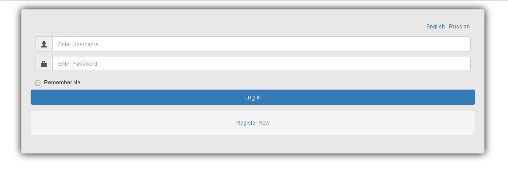
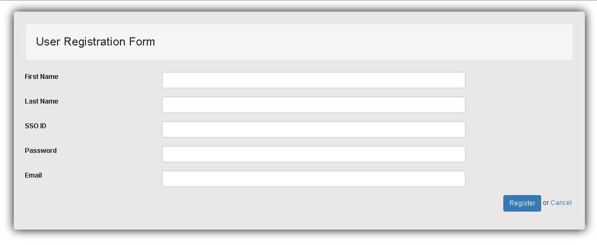
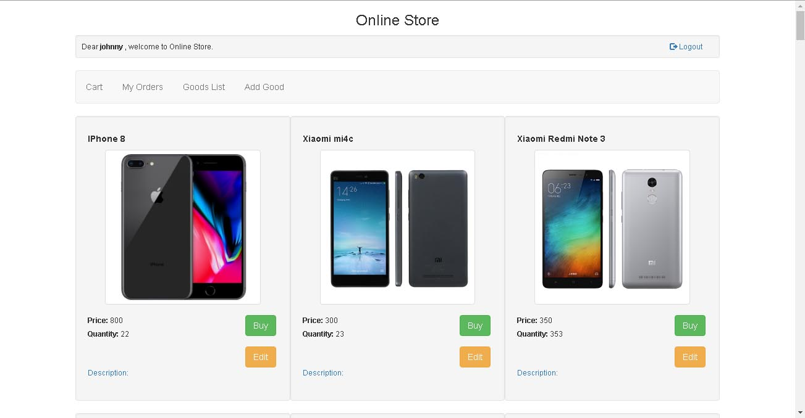

# Online Store Modern

## Description:

Web Application is a typical Online Store, 
where the administrator maintains(add new, edit and delete old) the catalog of the goods, 
and the customer does and pays the orders for the goods. 
Customer can see the history of his orders, confirm and pay them. 
Unregistered users can register in the system.

Application implements REST API for working with goods entities.
 
Architecture based on Spring MVC and other GoF design patterns.
Data stored in DB, with access provided using Hibernate and MySQL Connector. 
DAO layer implemented using Spring Data JPA.
Ehcache used for Hibernate second level cache.
Transactions maintained by Spring declarative transaction management.
For securing of web application used Spring Security 4 framework. 
Application supports Internationalization(i18n) and Localization (L10n).
Application uses POJOs, Servlets and JSPs, HTML5 and JSTL, Thymeleaf.
Servlet Container used in project is Apache Tomcat 8.
Apache Maven used for building.
Logging implemented by AOP with AspectJ, Slf4j and Logback.
Project Lombok used for entities boilerplate.
Tests are written on JUnit and Mockito using Hamcrest.
Bootstrap 3 used for front-end.

## Technologies used:

- Java 8
- Spring 4
- Spring MVC
- JSP
- Thymeleaf
- Hibernate 5
- Spring Data JPA
- Spring Security 4
- [Ehcache 2](http://www.ehcache.org/) for Hibernate 2nd level cache
- JUnit 4
- Mockito
- AspectJ
- SLF4J
- Logback
- [Project Lombok](https://projectlombok.org/)
- [Bootstrap 3](https://getbootstrap.com/)
- Maven
- [MySQL Community Server](https://dev.mysql.com/downloads/mysql/) as relational database management system
- [Apache Tomcat 8](http://tomcat.apache.org/) as Java Servlet/JSP Container 
- IDE used in project is [IntelliJ IDEA 15](https://www.jetbrains.com/idea/)

## Application Screenshots:
 Login page:
 
 
 User registration form:
 
 
 All goods page:
 
 
## Installation:
 
To get the project you can simply use this HTTPS-link:  
https://github.com/quar17esma/OnlineStoreModern.git

## Disclaimer:

This project is intended for non-commercial educational purposes.